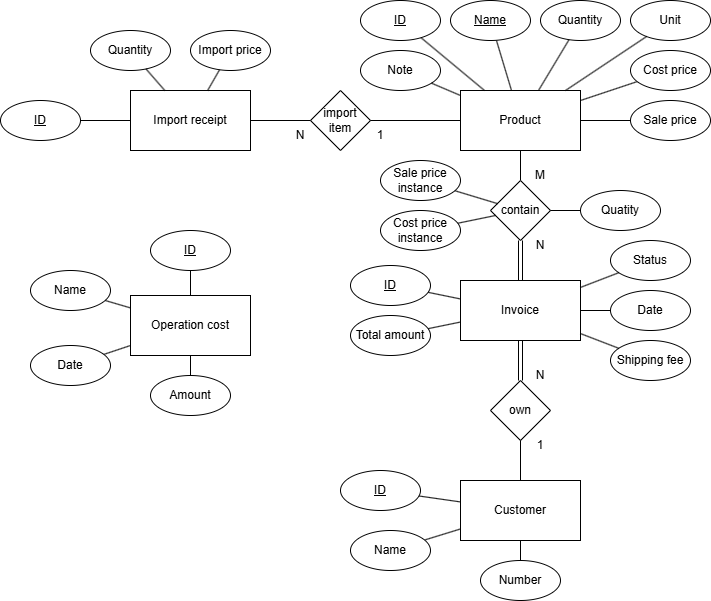

# Project record
**Version 1.0 March 16 2026**

## Features

### Stocking management

**Product property:** contain product current information like there current quantity and sale price.

**Import product record:** store product importation which contain date and import price.

### Sale report

**Operating cost:** allow user to update additional cost like fuels, salary, maintenance and more

**Cutomer top buyer:** display top buyer of a time interval

**Debt monitor:** user can view and update the status of invoices to "paid" or "unpaid".

### Invoice

Write invoices that include information of:
- Purchase date.
- Products name, unit, quantity, sale unit price, shipping fee, and total price.
- Customer name, phone number.
- Payment statement.

### Action control
This feature allow user to view, undo, redo previous actions in the program

## Database design

